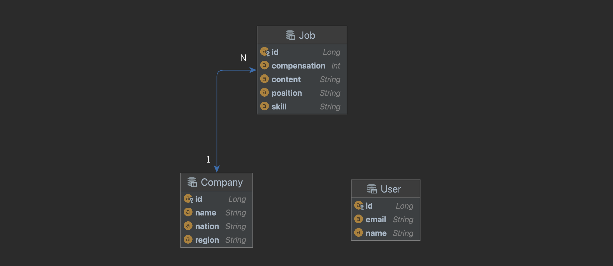

# 원티드 프리온보딩 백엔드 과제

> 채용을 위한 웹 서비스로 회사는 채용공고를 생성하고, 이에 사용자는 지원합니다.

 

## 기능 요구 사항

- 채용공고 등록
- 채용공고 수정
- 채용공고 삭제
- 채용공고 목록 조회(검색)
- 채용공고 상세 조회
- 사용자 채용공고 지원

 

## 구현 내용

- **채용공고 등록, 수정, 삭제, 목록 조회, 상세 조회, 검색 구현 완료**
- 도메인: 회사 `company`, 사용자 `user`, 채용공고 `job`
- 연관관계:  `company` 1 : n `job`   **양방향**

  - 회사는 여러 채용공고를 가질 수 있습니다.
  - 채용공고를 통해 회사의 정보를 확인할 수 있습니다.
- `@Query`를 이용한 검색 기능
  - 회사명, 채용공고의 포지션과 기술 필드에 키워드가 포함되어 있다면 조회

 

## API 명세서

#### Job(채용공고)

|               Action               | Verbs  | URL Pattern  |
| :--------------------------------: | :----: | :----------: |
|        모든 채용공고 목록 조회        |  GET   |    /jobs    |
|           채용공고 상세 조회         |  GET   | /jobs/{jobId} |
|         채용공고 검색         |  GET  |    /jobs/search?keyword=    |
|      채용공고 등록      |  POST  |         /jobs         |
|      채용공고 수정      |  PUT   |      /jobs/{id}       |
| 채용공고 삭제 | DELETE | /jobs/{id} |

 

## ERD

​    